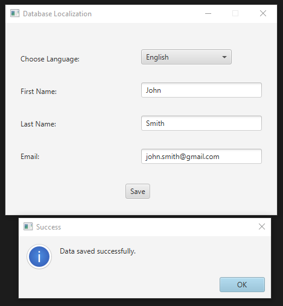
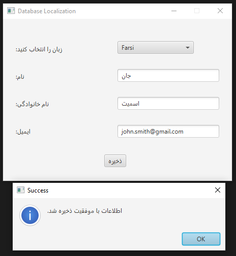
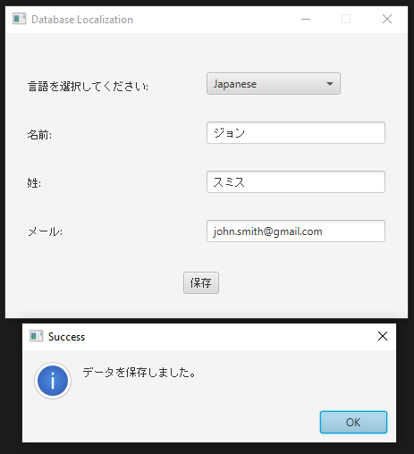
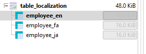
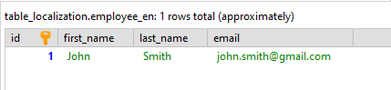
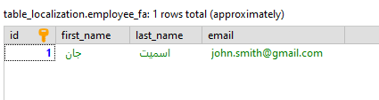
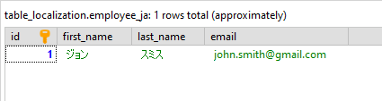

# Database Localization
----------------------------------

### Description:

This JavaFX application allows users to input employee data (first name, last name, email) and select a language (English, Farsi, Japanese) for the UI. The data is then saved to a MySQL database with localization support.

### Components:

*   **FXML File:** `display.fxml` - Defines UI layout and components.
*   **Controller Class:** `Controller.java` - Handles UI events and database operations.
*   **Resource Bundles:** `messages_en_US.properties`, `messages_fa_IR.properties`, `messages_ja_JP.properties` - Contains localized strings for UI elements.

### Localization:

*   Supports English, Farsi, and Japanese languages.
*   Dynamically updates UI text based on the selected language.

### Database Interaction:

*   Uses JDBC to connect to a MySQL database (`table_localization`).
*   Inserts data into language-specific tables (`employee_en`, `employee_fa`, `employee_ja`) based on language selection.

### Usage:

1.  Ensure Java and MySQL are installed.
2.  Create `table_localization` database and language-specific employee tables.
3.  Update database connection details in `Controller.java`.
4.  Run the JavaFX application to add employee data.

### Notes:

*   Include MySQL JDBC driver (`mysql-connector-java`) in project dependencies.
*   Handle exceptions for database connectivity and SQL operations.

### Screenshots:

Application UI in English, Farsi, and Japanese languages:

Database tables:

### Technologies Used:

- **JavaFX**: Used for building the graphical user interface.
- **FXML**: Used for defining the UI layout.
- **MariaDB**: Used as the relational database management system.
